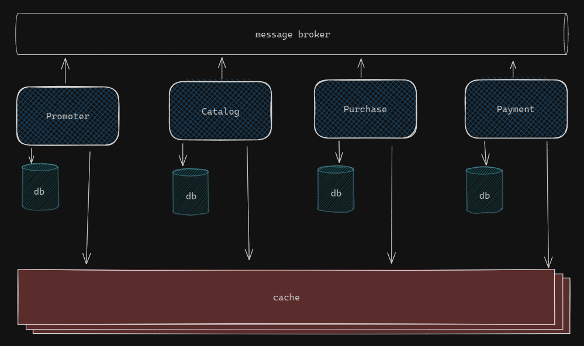
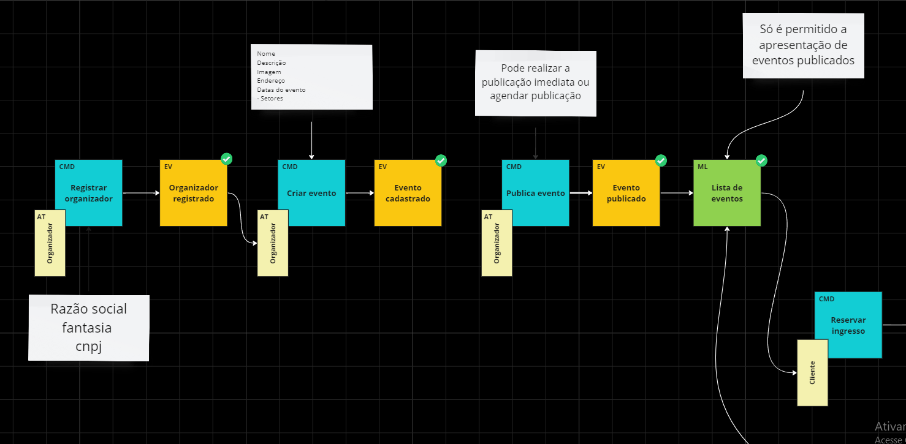

# Ticket store
A premissa do sistema é a venda de ingressos online.
Onde posso demonstrar todo conhecimento adquirido ao longo da minha carreira 

## Desafios
- O sistema deve suportar grandes picos de acesso
- O sistema deve garantir que um ingresso pertença a unico cliente

## Arquitetura
- Microsserviços

- Arquitetura orientada a eventos


## Padrões de projeto
- Domain-Driven Design (DDD)
- CQRS
- Vertical slice

## Events storm
Para a concepção do projeto, foi realizado o event storm para descobrir os eventos para
[ver mais.](https://miro.com/welcomeonboard/ZDlOVHlYTzRrMFN1aVppMkFzN0l0bEVTRk1rZ0xhaG1FcENsNDhjU29KNWpZdHhLNzVRMkpUZmVxU2FoeDJkYXwzNDU4NzY0NTg0NzkwMTQ1MTQzfDI=?share_link_id=131185290624)

## Como executar
O projeto utiliza Docker e Docker Compose. Certifique-se de ter o Docker instalado em sua máquina. Na raiz do projeto, abra o terminal e execute:
```
docker compose up
```
As APIs estarão rodando nos seguintes links:
- [Promoter](http://localhost:5286/swagger/index.html)
- [Catalog](http://localhost:7139/swagger/index.html)

## Entendo o projeto
O projeto está dividido em:
- Núcleo compartilhado, onde estão as abstrações e contratos comuns a todos os serviços, chamado de **BuildingBlocks**
- Serviços

Os serviços estão organizados em quatro camadas:
- **API**: Responsável pela interação com o usuário.
- **Application**: Realiza a orquestração, invocando o domínio e consultando o banco de dados.
- **Domain**: Centraliza toda a lógica de negócio.
- **Infra**: Responsável pela implementação e comunicação com serviços externos.

##### Gerar coverage
```
dotnet test -p:CollectCoverage=true -p:CoverletOutputFormat=lcov -p:CoverletOutput=./lcov.info
```